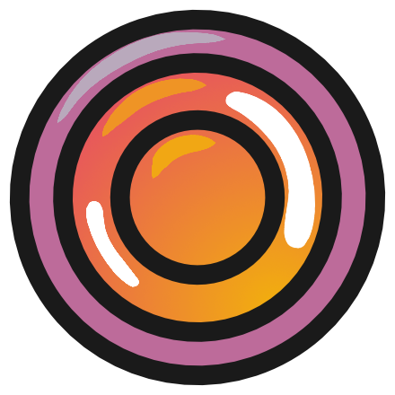

    

# XiLens
The `XiLens` application allows you to connect to all `XIMEA` cameras and record images to highly optimized n-dimensional
arrays that can be post-processed at high speed.

## Application features
* Compatible with all XIMEA cameras: spectral, RGB & gray cameras
* Highly optimized data storing at video-rate: n-dimensional arrays
* Multi-instance run for recordings with multiple cameras in parallel
* Long-term stability, tested for recordings of 24 hours at over 20 fps
* Camera temperature logged automatically during recording
* Compatible with Linux systems
* Automatic tests of non-UI components through google tests

# Documentation
The documentation for this project is hosted in [Read The Docs](https://xilens.readthedocs.io).

# Building XiLens from source
This software can be built following the instructions provided in out [Getting Started guide.](https://xilens.readthedocs.io/en/latest/getting_started.html)

# Contributing
If you are interested in contributing a feature, please follow the [developer guidelines.](https://xilens.readthedocs.io/en/latest/developer_guidelines.html)

# FAQ
If you are having issues, make sure to check the [FAQ section](https://xilens.readthedocs.io/en/latest/faq.html) of our documentation.

# Acknowledgments
Data compression is possible in this application thanks to the [BLOSC2 team](https://github.com/Blosc/c-blosc2).

The dark amber theme used for this application is a modified version of
[qt-material](https://github.com/UN-GCPDS/qt-material/tree/master).

The command line interface used in this application was provided by [CLI11](https://github.com/CLIUtils/CLI11).

The user interface was designed using [Qt](https://github.com/qt/qt5).

The tests were developed using [GoogleTest](https://github.com/google/googletest).

Many image processing operations are internally performed through [OpenCV](https://github.com/opencv/opencv).

# Remarks
The XiLens library is only supported in Linux systems, although all dependencies are also available in Windows systems,
compilation in such systems has not been properly tested.

# Funding
This project has received funding from the European Research Council (ERC) under the European Union’s Horizon 2020 research and innovation programme (grant agreement No. [101002198]).

